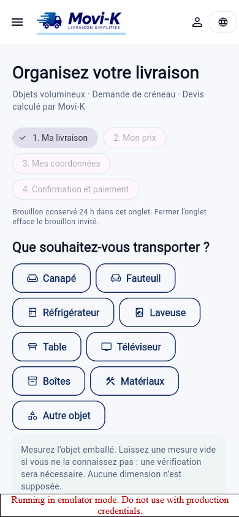
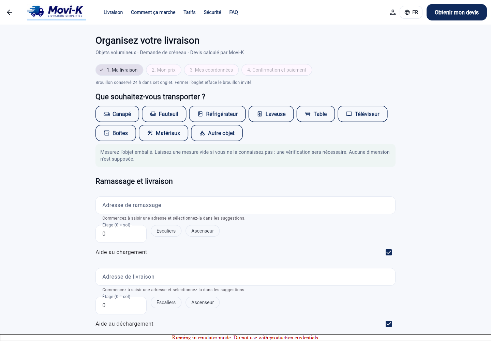

# Parcours client Movi-K — livraison de revue

Branche : `audit/public-launch-granby`. Aucun déploiement ni fusion en production.

## Parcours livré

1. **Ma livraison** : démarrage invité; catalogue de neuf objets illustrés par icônes; quantités, mesures de l’objet emballé, cm/pouces, kg/lb, données inconnues et approximatives; deux adresses résolues, accès distincts, aide au chargement/déchargement, équipement, manutentionnaires et date souhaitée. Photos JPEG privées facultatives après connexion (trois par objet, 5 Mo chacune).
2. **Mon prix** : connexion requise pour le devis officiel, explicitement annoncée. Recommandation serveur; informations insuffisantes → précisions ou demande de vérification privée. Aucun prix réservable dans cet état. Options alternatives uniquement parmi les catégories compatibles, nouveau devis obligatoire. La disponibilité d’un chauffeur reste à confirmer.
3. **Mes coordonnées** : compte existant, préremplissage depuis `users/{uid}.booking_contacts`, contacts aux deux arrêts, vérification du courriel par Firebase; seules les méthodes d’authentification existantes sont utilisées.
4. **Confirmation et paiement** : récapitulatif modifiable, politique d’annulation et de paiement approuvée, consentement versionné avec date serveur, marketing distinct, carte via Stripe Checkout en mode `setup`. Confirmation explicite, référence de mission, suivi existant et soutien.

Le suivi et le chauffeur affichent le chargement figé. Le chauffeur confirme le véhicule vérifié qu’il utilisera avant l’acceptation. Les contacts sont dans une sous-collection privée accessible au client, au chauffeur assigné et au personnel autorisé.

## Règles de capacité et limites physiques

Aucune capacité réelle n’a été inventée ou ajoutée en production. `system_config/booking_capacity` doit être approuvé et contenir une version, les seuils de manutention et des capacités vérifiées.

Chaque capacité exige : `category`, `rank`, `version`, `verified`, `length_cm`, `width_cm`, `height_cm`, `opening_width_cm`, `opening_height_cm`, `payload_kg`, `handlers`, `equipment`, `services` (`handling`, `stairs`). Les dimensions doivent décrire un espace utile libre et une ouverture utilisable; la charge utile doit être disponible après occupants et matériel.

Algorithme conservateur : orientations orthogonales autorisées, respect du maintien debout, ouverture et hauteur vérifiées, placement en rangées sans chevauchement au sol, sans empilage. Le poids est multiplié par les quantités. Le volume seul n’autorise jamais une livraison. Maximum 20 pièces; au-delà, vérification manuelle. Cette méthode peut refuser un chargement physiquement possible : elle ne certifie pas la manutention dans un escalier, le passage dans une porte de bâtiment ou un chargement diagonal. Ces cas exigent une vérification opérationnelle.

Le serveur contrôle à nouveau le véhicule réel dans la transaction d’acceptation et d’assignation administrative. Sources : `driver_vehicles/{id}.verified_capacity`, `is_verified`, `capacity_valid_until`. Une simple catégorie ou un `max_payload_kg` déclaré par le chauffeur est insuffisant. Le dispatch exclut les véhicules inconnus, expirés ou incompatibles. Les capacités vérifiées sont interdites en écriture au chauffeur.

## Données et sécurité

- Invité : `sessionStorage` par onglet, expiration 24 h; pas d’adresse ni de contact dans l’URL. Un transfert explicite valable 15 minutes rattache le brouillon au compte choisi lors de la connexion.
- Compte : copie locale dans l’onglet et `booking_drafts/{uid}` privé, écrit par callable; propriétaire vérifié, révisions, sauvegarde après saisie, expiration et nettoyage planifié. En natif, la copie locale est en mémoire; la reprise persistante nécessite la copie serveur.
- Les anciens brouillons sont migrés sans utiliser leur ancienne sélection de véhicule comme preuve de capacité; les mesures manquantes exigent une précision.
- Les devis sont relus et leur intégrité vérifiée à la reprise. Objets, accès, services et règles de capacité font partie du snapshot haché. Une modification invalide le devis et le consentement.
- `booking_attempts/{uid}_{draftId}` empêche une seconde mission, même après recalcul du devis. Le devis consommé permet aussi de retrouver la mission après une réponse réseau perdue.
- Photos : chemins Storage, pas d’URL publique à jeton. Lecture authentifiée; le grant de mission autorise les chauffeurs admissibles à voir les photos avant acceptation. Contacts et courriel restent privés.
- `booking_reviews` constitue la file de vérification, lisible par le propriétaire et les analystes. Aucune mission ou opération monétaire n’y est créée. Le personnel doit traiter cette file; la demande ne promet aucun délai de réponse. Les vérifications expirent après sept jours.
- Les photos de brouillons expirés sans mission ni vérification active sont supprimées. Les photos liées à une mission suivent la conservation des dossiers de livraison.

## Paiement et invariants

Checkout `mode=setup` enregistre une carte, sans débit de livraison. Retour fixe vers le parcours; aucun succès n’est déduit de l’URL. Le serveur relit la session et le SetupIntent, contrôle propriétaire, client Stripe, devis, environnement et état terminé. Le webhook signé `checkout.session.completed` utilise la même validation; les reprises sont idempotentes.

L’autorisation reste dans `acceptDelivery`; la capture dans `completeDelivery`. Tarifs, commissions, taxes, remboursements et règles d’annulation sont conservés. Les options chargement/déchargement utilisent les **montants déjà configurés** `loading_fee` et `unloading_fee`; les deux moteurs serveur/Dart ont des indicateurs correspondants, faux pour les appels historiques. Aucun prix financier n’est calculé dans le nouveau formulaire.

Invariant : devis officiel = mission = snapshot financier = montant autorisé, en cents. Les anciennes missions sans snapshot de chargement conservent leur contrat historique.

## Configuration requise avant un essai client réel

| Élément | Action requise |
| --- | --- |
| Capacité des catégories | Renseigner puis approuver `system_config/booking_capacity`; partir du modèle désactivé dans `config/booking_capacity.template.json`. Aucun nombre de test ne doit être copié en production. |
| Véhicules réels | Vérifier les mesures, ouverture, charge disponible, équipements et équipe; renseigner `verified_capacity` et son échéance sur chaque véhicule autorisé. |
| Zone | `system_config/service_zones` activé et rectangles approuvés. Une zone absente empêche un devis du nouveau parcours. |
| Conditions | Renseigner les textes et URL approuvés de `system_config/booking_policy`, versions FR/EN/ES; modèle désactivé fourni. Ne pas inventer des frais d’annulation. |
| Migration | Activer `require_booking_details: true` pour interdire la création via les anciens clients sans chargement décrit. Sans ce drapeau, les anciens appels restent compatibles. |
| Stripe | Clé Sandbox uniquement pour essais; profil de même environnement, endpoint plateforme abonné à `checkout.session.completed`; domaine HTTPS de retour `APP_PUBLIC_BASE_URL` correspondant à l’app de test. |
| Fonctions et règles | Déployer ensemble les fonctions de réservation, règles Firestore/Storage et ordonnanceur dans un projet de test. Aucune action de déploiement n’a été exécutée ici. |
| Index | Requêtes simples bornées; les index automatiques sur `expires_at` doivent rester activés. Aucun nouvel index composite n’est requis par ces ajouts. |
| Exploitation | Personnel habilité à traiter `booking_reviews`; données réelles de capacité, politique et disponibilité à valider avant ouverture. |

## Validation

Validation exécutée le 1er octobre 2026 dans la copie de revue Windows. Firebase : projet démonstration `demo-movik-test`, émulateurs Auth/Firestore/Storage. Les jeux de données sont synthétiques; ils ne constituent pas des capacités ou politiques de production.

| Contrôle | Résultat observé |
| --- | --- |
| Suite Flutter complète | **646 tests réussis**, 3 min 45 s. |
| Dernière passe Flutter ciblée (adresses, auth, reprise, double clic, erreurs) | **23 tests réussis** après les ajustements du formulaire. |
| Analyse Flutter | **Aucun problème** après formatage et corrections de style. |
| Build Web release | **Réussi**, avec `USE_FIREBASE_EMULATORS=true`; dernière compilation 119,4 s. |
| Backend unitaires sous Node **20.20.2** | **15 suites, 228 tests réussis**, 27,9 s. |
| Intégration complète Firebase | **41 suites, 616 tests réussis**, 352,2 s, sous Node 24.15.0 de la machine. |
| Dernière passe ciblée réservation et Storage | **2 suites, 28 tests réussis**, 35,1 s. Inclut la reprise Checkout, l’isolement des photos et le nettoyage après panne Storage. |
| TypeScript et ESLint | Compilation et lint réussis; compilation également vérifiée avec Node 20. |
| Navigateur Chrome | Captures 390 × 844 et 1440 × 1000; **aucune erreur JavaScript de page** (`booking-browser-errors.json`). |
| Stripe Sandbox réel | **Non exécuté** : aucune clé de test disponible dans l’environnement de travail. Aucun paiement réel effectué. |

Les suites complètes ont précédé les derniers correctifs ciblés; les nombres des passes ciblées ne s’ajoutent pas intégralement aux suites complètes. Les tests de règles couvrent notamment l’isolement des brouillons, contacts, capacités et photos. La réservation couvre les conversions, données inconnues, chargements incompatibles malgré un volume suffisant, véhicule réel, consentement, idempotence entre devis et reprise d’authentification bancaire simulée. Les suites financières existantes couvrent acceptation concurrente, absence de chauffeur, capture, refus simulés et historique.

Avertissements du build : information Flutter sur le mode Wasm et avertissement de police Cupertino provenant de l’arbre de dépendances. Aucun usage direct de `CupertinoIcons` trouvé dans `lib`; les icônes du nouveau parcours et les deux rendus ont été vérifiés. Les messages PowerShell de type `NativeCommandError` provenant de stderr ne constituent pas à eux seuls un échec : les résultats ci-dessus reposent sur les résumés de tests et le marqueur `Built build\web`.

Commandes reproductibles depuis la racine (adapter les chemins Windows si nécessaire) :

```text
.flutter\bin\flutter.bat test
.flutter\bin\flutter.bat analyze --no-pub
.flutter\bin\flutter.bat build web --release --no-pub --dart-define=USE_FIREBASE_EMULATORS=true
# Depuis functions/
npm run build
npm run lint
npx --yes --package=node@20 node node_modules/jest/bin/jest.js --testPathPatterns=test/unit --runInBand
npm run test:integration
```

Les journaux détaillés restent dans `artifacts/booking-*.log` sur la copie de revue, ignorés par Git. La synthèse versionnée est [booking-validation.json](../artifacts/booking-validation.json).

### Captures

Le script [capture_booking_review.js](../scripts/capture_booking_review.js) ouvre le build local à `http://127.0.0.1:8091`. Il intercepte uniquement la configuration publique avec une politique indisponible; il ne présente aucun faux devis ni faux paiement. Les captures montrent le démarrage invité du formulaire; elles ne constituent pas une recette bancaire ni une capture de toutes les étapes authentifiées.

[Mobile — 390 × 844](../artifacts/booking-mobile.png) · [Ordinateur — 1440 × 1000](../artifacts/booking-desktop.png)





Les tests de paiement dans Firebase utilisent un fournisseur simulé. Une exécution Stripe Sandbox réelle exige une clé de test et un compte connecté de test; leur absence ne doit jamais être présentée comme un paiement réussi.

## Limites assumées

- Pas d’estimation publique anonyme : repli autorisé par le cahier des charges, connexion avant devis officiel.
- Pas de reconnaissance ou de mesure par IA à partir des photos.
- Les créneaux sont des souhaits, sans promesse de réservation horaire ferme.
- Les captures du formulaire sont des captures locales avec build Firebase émulateur; elles ne prouvent pas qu’un paiement bancaire réel est passé.
- La page de vérification opérationnelle est une collection privée utilisable par les outils d’administration Firebase existants; pas de nouvelle console de traitement dédiée ni de notification de délai garanti.


## Fichiers et fonctions livrés

L’inventaire exact des fichiers de ce changement figure dans [booking-changed-files.txt](../artifacts/booking-changed-files.txt); les anciennes captures hors de cette livraison ne sont pas incluses.

| Ensemble | Fichiers principaux |
| --- | --- |
| Parcours Flutter | `lib/screens/delivery/delivery_request_flow_screen.dart`, `lib/services/booking/*`, `lib/widgets/booking_load_summary.dart` |
| Intégration de l’existant | suivi client, missions chauffeur, onglet missions, modèle mission, auth, brouillon historique, bootstrap Firebase |
| Capacité et devis | `functions/src/lib/booking.ts`, `bookingServer.ts`, `quoteIntegrity.ts`, `calculateDeliveryQuote.ts` |
| Confirmation et affectation | `createDeliveryRequest.ts`, `acceptDelivery.ts`, `adminAssignDelivery.ts`, `dispatchMissionToDrivers.ts` |
| Paiement | `bookingCardSetup.ts`, `bookingPayment.ts`, providers, profil de paiement, webhook Stripe |
| Brouillons et exploitation | `bookingJourney.ts`, exports `functions/src/index.ts` |
| Sécurité et configuration | `firestore.rules`, `storage.rules`, `config/booking_*.template.json` |
| Vérification | tests Flutter, unitaires et intégration; script et captures dans `scripts/` et `artifacts/` |

Nouvelles fonctions : `getBookingConfiguration`, `reviewDeliveryLoad`, `saveBookingDraft`, `getBookingDraft`, `clearBookingDraft`, `getBookingQuote`, `requestBookingReview`, `getBookingVehicleForAcceptance`, `startBookingCardSetup`, `getBookingCardStatus`, ordonnanceur `cleanupBookingDrafts`. Le nettoyage garde une entrée expirée jusqu’à la suppression Storage réussie, afin de réessayer après une panne. Les grants de photo sont rattachés au client et au brouillon.

## Verdict et prochaine étape concrète

**Code livré pour revue; essai client complet encore bloqué.** Les obstacles restants sont les données opérationnelles approuvées (capacités de catégories et véhicules réels, zone, politique), la configuration du projet de test et la recette Stripe Sandbox réelle. Aucune capacité, condition contractuelle ni clé n’a été inventée pour masquer ces absences.

Ordre de la recette restante :

1. Renseigner et faire approuver les modèles de configuration, vérifier un véhicule réel et les comptes de test client/chauffeur.
2. Déployer la branche et les règles ensemble dans un environnement de **test**, configurer le retour HTTPS et le webhook Sandbox.
3. Exécuter le parcours navigateur connecté, Checkout Sandbox réussi/refusé/interrompu, acceptation par le véhicule vérifié, livraison avec preuve, capture et historique. Comparer les montants en cents sur devis, mission, snapshot et PaymentIntent.
4. Consigner les références et résultats de cette recette avant de déclarer le service prêt pour des clients réels.

Branche : `audit/public-launch-granby`. Le commit de livraison est celui qui ajoute le présent rapport et sa synthèse de validation. Aucun merge ni déploiement de production n’a été effectué.
